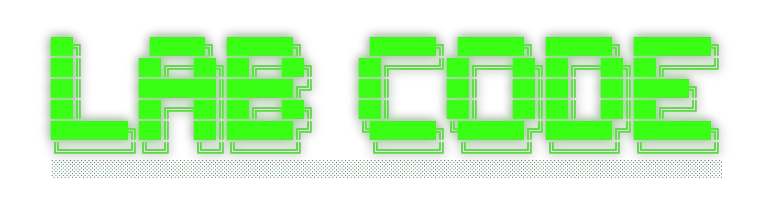
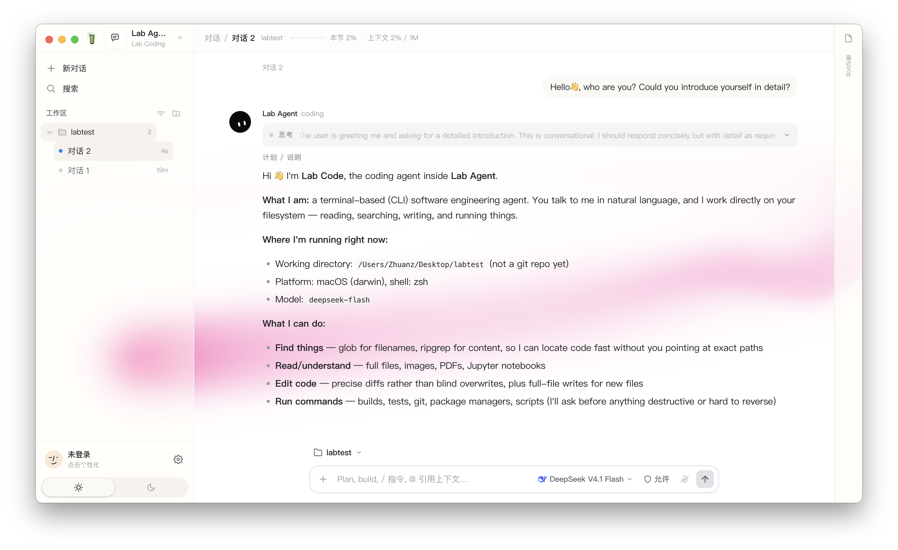

<p align="center">
  
</p>

<p align="center">
  <strong>The open-source coding agent.</strong><br />
  Lab Code engine in the terminal · Lab Agent desktop shell on the same engine.
</p>

<p align="center">
  <a href="https://www.labagent.online"><strong>www.labagent.online</strong></a><br />
  Official site · docs · downloads
</p>

<p align="center">
  <a href="https://github.com/lant1ng-1216/lab-agent/releases"></a>
</p>

---

### Notes

> [!IMPORTANT]
> **macOS**
> 1. Download the zip from [Releases](https://github.com/lant1ng-1216/lab-agent/releases) → unzip → double-click `Lab Agent.app`
> 2. If macOS says it cannot verify the developer: **System Settings → Privacy & Security → Open Anyway** (once)
> 3. When the app asks to access your project folder, click **Allow**
> 4. Add an API key in settings, then chat / run tools

> [!WARNING]
> **Windows**
> Windows builds now use a native Windows title bar, system shell, and Windows font metrics. Please still verify your target Windows version and display scaling (100% / 125% / 150%) before distribution.
> If you hit issues on Windows (or anywhere else), email feedback to **[zfu9751@gmail.com](mailto:zfu9751@gmail.com)** with OS version, steps, and screenshots (redact API keys).

> [!NOTE]
> **Skins**
> The first time you open a skin (e.g. Glass), there can be a short load hitch while assets initialize. Wait a moment — it is loading, not frozen.

---

### Desktop install

| Platform | Artifact |
| -------- | -------- |
| macOS (Apple Silicon) | `Lab-Agent-*-mac-arm64.zip` |
| Windows (x64) | `Lab-Agent-*-win-x64.zip` |
| Linux (x64) | `Lab-Agent-*-linux-x64.tar.gz` |

Default UI is **light (白昼)**; you can switch dark mode or Glass skin in-app.

Configure a model API key after open (DeepSeek by default — see Configuration).

### Terminal (Lab Code only)

```bash
git clone https://github.com/lant1ng-1216/lab-agent.git
cd lab-agent/agents/lab-coding
cp lab-agent.env.example lab-agent.env   # set your API key
bun install && bun run build:dev
./start-lab-agent.command /path/to/your/project
```

### Desktop from source

```bash
git clone https://github.com/lant1ng-1216/lab-agent.git
cd lab-agent
cd agents/lab-coding && cp lab-agent.env.example lab-agent.env && bun install && bun run build:dev && cd ../..
npm install
env -u ELECTRON_RUN_AS_NODE npm run desktop
```

---

### What it is

- **Lab Code** — coding-agent runtime (tools, sessions, TUI, permissions) under [`agents/lab-coding/`](./agents/lab-coding/)
- **Desktop shell** — Electron + React UI at the repo root; spawns the same engine binary
- **Workspaces** — sessions stay bound to a folder; new chat is a draft until the first send

Inspired by how projects like [OpenCode](https://github.com/anomalyco/opencode) ship core + desktop together.

---

### Configuration

Copy [`agents/lab-coding/lab-agent.env.example`](./agents/lab-coding/lab-agent.env.example) to `lab-agent.env` (never commit the real file). Set your API key and official base URL:

- **DeepSeek** — key + `https://api.deepseek.com` (default; DeepSeek Flash)
- **OpenAI** — key + `https://api.openai.com/v1` (模型列表可读取；Lab Coding 对话当前仍要求 Anthropic Messages 兼容接口)

The desktop Lab Coding runtime currently sends Anthropic Messages requests. DeepSeek should use `https://api.deepseek.com` in the UI; the runtime maps it to DeepSeek's official Anthropic-compatible endpoint internally. Custom gateways must expose the same Anthropic Messages contract. OpenAI Chat Completions routing is intentionally reported as unsupported instead of silently sending the wrong request format.

The desktop app can also take a key from its settings UI.

The API dialog verifies the credential by loading the provider's model list before saving the model snapshot. A snapshot marked 未验证 or 验证失败 is not treated as a healthy connection. An explicit configuration saved in the dialog takes precedence over lab-agent.env; legacy local settings without a source marker are revalidated during startup so an old key cannot silently shadow the environment configuration.

---

### Development

```bash
npm run desktop          # Electron shell (engine must be built)
npm run build            # compile main + renderer
npm run prepare:engines  # cross-compile engine binaries for installers
npm run dist             # engines + app + electron-builder → release/
```

Engine scripts live in `agents/lab-coding` (`bun run build:dev`).

---

### Contributing

Issues and PRs welcome. Please note terminal vs desktop, OS, and steps to reproduce (redact keys).

Bugs / Windows feedback: **[zfu9751@gmail.com](mailto:zfu9751@gmail.com)**

### Acknowledgments

Thanks to the following projects and teams: **Beautiful UI**, **DiceBear**, **Codrops**, **DeepSeek harness**.

### License

[Apache-2.0](./LICENSE). You may use, modify, and distribute Lab Agent (including commercially), as long as you keep the license and copyright notices. Apache-2.0 also includes an express patent grant; it is not a copyleft license (unlike GPL).

Formerly **vibe-lab**; renamed to **lab-agent** (stars preserved).
